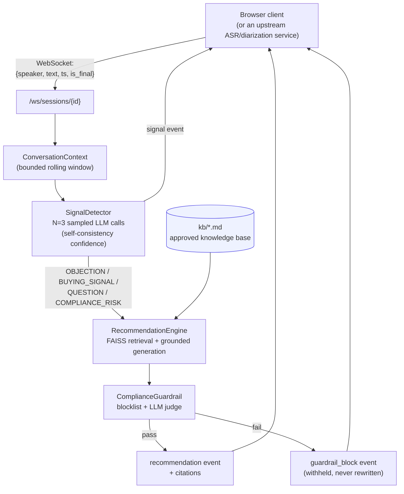

# Real-Time Conversation Signal Copilot

A production-shaped, end-to-end example of a **live conversation-intelligence
assistant**: it streams conversation turns as they happen, tags each one
with multi-lable signals (objection, buying signal, compliance risk,
question, action item), retrieves a grounded next-best-action recommendatoin
from an approved knowledge base via RAG (with citations), and enforces a
compliance guardrail layer that **withholds** (never silently rewrites) a
recommendation it can't clear.

This repo exists to demonstrate what a real-time, human-in-the-loop
conversational AI system's plumbing actually looks like -- not just an LLM
call behind a chat box, but the surrounding pieces (streaming, grounding,
guardrails, PII handling, observability) that make one trustworthy enough
to put in front of a live conversation.

## What it does

**Backend:** Python 3.11 / FastAPI, WebSocket streaming, FAISS-backed RAG
over a small Markdown knowledge base, a self-consistency-based multi-label
signal classifier, a two-layer compliance guardrail, and Prometheus metrics.

**Frontend:** React 18 / TypeScript / Vite. A live transcript view with
signal badges (label + confidence), a recommendation panel with citations,
and a "replay a sample call" button so you can see the whole pipeline run
without needing a live audio source.

### Architecture



### Why streaming, not request/response

A recommendation that arrives after the moment in the conversation has
passed isn't useful. The WebSocket streams each pipeline stage's output as
soon as it's ready -- the signal badge can appear while the (slower) RAG
recommendation is still being generated -- instead of making the UI wait
for the full pipeline before showing anything. See
[`docs/adr/0001-websocket-streaming.md`](docs/adr/0001-websocket-streaming.md).

### Why RAG grounding, and why it's not enough by itself

The recommendation engine is instructed to answer only from retrieved
knowledge-base chunks and to cite them -- that's what makes a recommendation
auditable ("show me where that came from") instead of an opaque LLM opinion.
But grounding doesn't eliminate hallucination risk on its own, which is
exactly why there's an independent guardrail layer downstream re-checking
the *output*, not just constraining the *input*. Two different lines of
defense, not one.

### Why guardrail failures withhold instead of rewrite

When the guardrail (a fast blocklist pass, then an LLM-as-judge pass) flags
a recommendation, it is withheld and flagged for human review -- never
auto-rewritten into a "safer" version. Auto-rewriting would mean a model
decides what's compliant, which is exactly the judgment call this system
should escalate to a human, not make silently. See
[`docs/adr/0003-guardrail-withhold-not-rewrite.md`](docs/adr/0003-guardrail-withhold-not-rewrite.md).

### A deliberate simplification: confidence via self-consistency

There's no trained classifier here with a calibrated softmax probability --
just an LLM asked to emit JSON. Confidence is approximated by sampling the
model 3 times and measuring how often the samples agree, which is a useful
*relative* signal but not calibrated probability. This is a known,
documented limitation -- see
[`docs/adr/0002-confidence-via-self-consistency.md`](docs/adr/0002-confidence-via-self-consistency.md)
for why, and the companion
[`conversational-ai-eval-golden-dataset-framework`](https://github.com/manuelbomi/conversational-ai-eval-golden-dataset-framework)
repo for how to actually measure this detector's real-world reliability
against human-adjudicated ground truth.

## Repo layout

```
backend/
  app/
    signals/       # taxonomy + multi-label detector (self-consistency confidence)
    rag/            # embeddings, FAISS store, grounded recommendation generation
    guardrails/     # blocklist + LLM-judge compliance review
    context/        # bounded rolling conversation window
    api/            # FastAPI app, WebSocket route, the per-utterance pipeline
    pii.py          # regex PII redaction, enforced at the one LLM call choke point
    llm.py          # provider-agnostic chat access (mock / OpenAI / Anthropic)
    metrics.py      # Prometheus histograms + counters
  kb/               # the approved knowledge base (synthetic, generic financial/sales domain)
  scripts/
    replay_transcript.py   # streams a sample transcript over the WebSocket
  tests/            # pytest, fully mocked; tests/live/ is an opt-in real-LLM smoke test
frontend/
  src/
    components/     # SignalBadge, RecommendationPanel, TranscriptView, ReplayControl
    hooks/          # useSessionStream (owns the WebSocket connection)
    api/            # types.ts (mirrors backend schemas), client.ts
    test/           # Vitest + React Testing Library
docs/
  PRODUCTION.md     # latency budget, scaling, K8s, observability, PII/audit, rollout
  adr/              # the three design decisions above, written out in full
deploy/k8s/         # Deployment, Service, HPA, PodDisruptionBudget, secrets template
docker-compose.yml
.github/workflows/ci.yml
```

## Setup & run

### Option A: Docker Compose (recommended)

```bash
docker compose up --build
```

Backend on `http://localhost:8000`, frontend on `http://localhost:5173`.
Runs with `LLM_PROVIDER=mock` by default -- no API key needed to see the
full pipeline work. To use a real model, set `OPENAI_API_KEY` or
`ANTHROPIC_API_KEY` in your shell before `docker compose up` and change
`LLM_PROVIDER` in `docker-compose.yml`.

### Option B: run locally

```bash
# backend
cd backend
python -m venv .venv && .venv/Scripts/activate   # or source .venv/bin/activate on macOS/Linux
pip install -r requirements.txt
cp .env.example .env   # optional -- defaults to mock provider
uvicorn app.main:app --reload

# frontend, in a second terminal
cd frontend
npm install
npm run dev
```

### See it run end-to-end without a live audio source

```bash
cd backend
python scripts/replay_transcript.py
```

This creates a session and streams `scripts/sample_transcript.jsonl` over
the WebSocket at a realistic pace, printing every signal/recommendation/
guardrail-block event as it arrives. The frontend's "Replay a sample call"
button does the same thing visually.

There's no live telephony/ASR pipeline in this repo -- the WebSocket's
`{speaker, text, ts, is_final}` event shape is a deliberate compatibility
contract with an upstream ASR/diarization service (see the companion
[`streaming-asr-diarization-pipeline`](https://github.com/manuelbomi/streaming-asr-diarization-pipeline)
repo, which emits events in this exact shape from real audio).

## Testing

```bash
cd backend && pytest -q                 # 39 tests, fully mocked, no API key needed
cd frontend && npm run test             # component tests, Vitest + RTL
```

`backend/tests/live/` holds an opt-in smoke test against a real provider
(`pytest -m live tests/live`, needs `OPENAI_API_KEY` or `ANTHROPIC_API_KEY`)
-- excluded from the default run and from CI, since it costs real money and
needs a real key.

## Taking this to production

[`docs/PRODUCTION.md`](docs/PRODUCTION.md) works through, concretely: the
target end-to-end latency budget per pipeline stage, horizontal scaling of
WebSocket fanout (Redis-backed session state, sticky sessions vs. pub/sub),
the Kubernetes manifests in `deploy/k8s/` (HPA scaling on active-session
count rather than CPU%, and why), Prometheus/structured-logging/OpenTelemetry
observability, PII handling and a guardrail audit trail, and a blue/green
rollout plan for changing the prompt or model safely.

## License

MIT -- see [LICENSE](./LICENSE).

---


### Thank you for reading

#### Please consider giving a star if you find the repo useful. Thank you.

---

### **AUTHOR'S BACKGROUND**
### Author's Name:  Emmanuel Oyekanlu
```
Skillset:   I have experience spanning several years in data science, enterprise AI architecture and solutions, developing scalable enterprise data pipelines,
enterprise solution architecture, architecting enterprise systems data and AI applications,
software and AI solution design and deployments, data engineering, industrial intelligent vision systems, high performance computing (GPU, CUDA), machine learning,
NLP, Agentic-AI and LLM applications as well as deploying scalable solutions (apps) on-prem and in the cloud.

I can be reached through: manuelbomi@yahoo.com

website: https://www.emmanueloyekanlu.com/
Publications:  https://scholar.google.com/citations?user=S-jTMfkAAAAJ&hl=en
LinkedIn:  https://www.linkedin.com/in/emmanuel-oyekanlu-6ba98616
Github:  https://github.com/manuelbomi

```
[](https://skillicons.dev)
